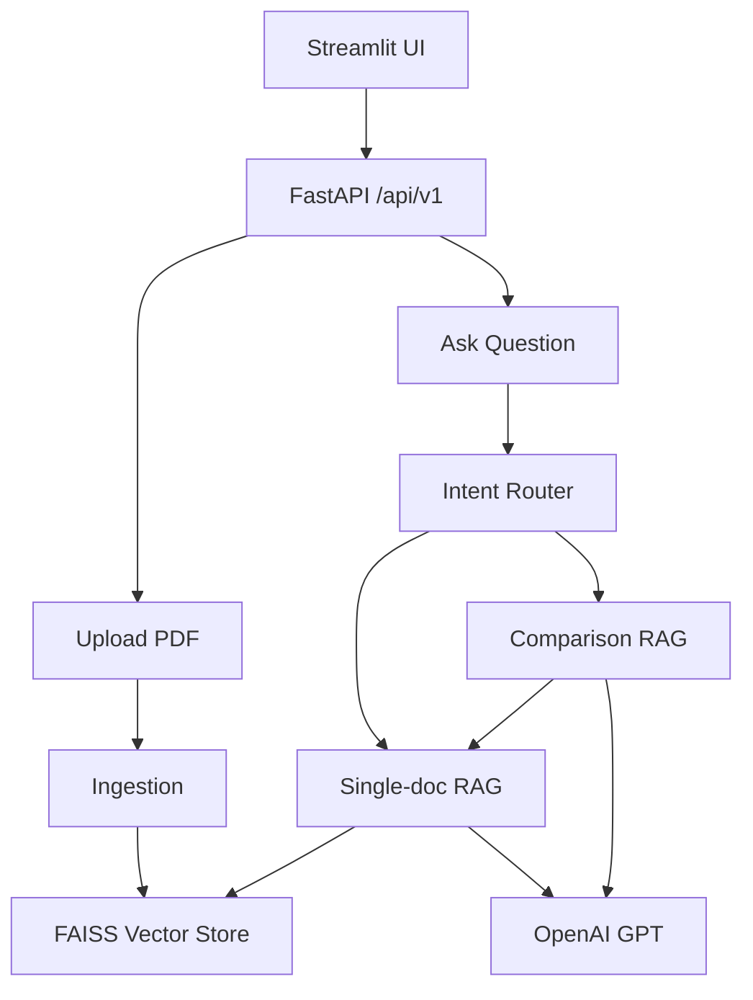

# Insurance Policy RAG Chatbot

A multi-document Retrieval-Augmented Generation (RAG) system for insurance policy Q&A and plan comparison. Built with **FastAPI**, **LangChain**, **FAISS**, **OpenAI**, and a **Streamlit** UI.


---
### Note all the names listed here are for educational purpose only
## Table of contents

- [Overview](#overview)
- [Architecture](#architecture)
- [What is implemented today](#what-is-implemented-today)
- [Project structure](#project-structure)
- [Setup and run](#setup-and-run)
- [API reference](#api-reference)
- [End-to-end user flow](#end-to-end-user-flow)
- [RAG pipeline (single Q&A)](#rag-pipeline-single-qa)
- [Comparison mode](#comparison-mode)
- [Documentation vs code](#documentation-vs-code)
- [Production readiness gaps](#production-readiness-gaps)
- [Roadmap (prioritized)](#roadmap-prioritized)
- [Resume talking points](#resume-talking-points)
- [Production-ready checklist](#production-ready-checklist)

---

## Overview

This project answers questions about uploaded insurance PDFs (e.g. Aetna, Cigna) using semantic search over chunked embeddings, with optional **side-by-side plan comparison** when multiple documents are selected or the question implies comparison.

**Core value:** Grounded answers with citations (file, page, snippet) instead of a generic chatbot.

---

## Architecture



**Target pipeline (full production vision):**

```
User Query
   ↓
Router (intent + doc selection)
   ↓
Retrieval (filtered OR global OR hybrid)
   ↓
Ranking (FAISS top-k → rerank)
   ↓
Context builder
   ↓
LLM
   ↓
Response + citations (+ optional faithfulness check)
```

---

## What is implemented today

### MVP — Single-document RAG

- Upload a PDF, chunk and embed into FAISS, ask questions, get answers with source references.

### MVP+1 — Multi-document knowledge base

- Sequential uploads into a **shared** FAISS index.
- Each file gets a UUID **`doc_id`**; metadata propagated to all chunks.
- Document registry in `data/doc_registry.json`.
- Provider tagging from filename (`aetna.pdf` → Aetna, `cigna.pdf` → Cigna).

### MVP+2 — Plan comparison

- **Rule-based** intent detection (`compare`, `vs`, `difference`, etc.) plus **LLM fallback** classifier.
- Comparison runs `ask_question` **per document**, then a second LLM call formats provider-separated output.
- Context grouped by provider (`### Aetna Policy`, etc.).

### MVP+3 — Planned (not fully built)

- Grounded citations with highlighting.
- Evaluation layer (faithfulness, hallucination checks).
- Production-grade reranking, hybrid search, API hardening, caching.

---

## Project structure

```
app/
  main.py                 # FastAPI app, CORS, static /data
  core/config.py          # Environment config
  api/router.py           # Route aggregation
  api/routes/
    upload.py             # PDF upload + registry
    query.py              # Ask endpoint
    documents.py          # List documents
    health.py             # Health checks
  services/
    ingestion.py          # PDF → chunks → FAISS
    vectorstore.py        # FAISS + OpenAI embeddings
    rag_ask_question.py   # Single-doc Q&A pipeline
    rag_comparison.py     # Multi-doc comparison
    intentrouter.py       # Rule + LLM routing
    llm.py                # Singleton ChatOpenAI
data/
  doc_registry.json       # Uploaded document metadata
  raw_pdfs/               # Stored PDFs (served at /data)
streamlit_app.py          # Web UI
example/agent.ipynb       # Exploratory notebook
readme.backup.md          # Original readme backup
```

---

## Setup and run

### Dependencies

```bash
pip install python-dotenv fastapi langchain langchain-community pypdf \
  langchain-text-splitters langchain-openai faiss-cpu uvicorn \
  python-multipart streamlit
```

### Environment

Create a `.env` file (see `app/core/config.py` for variables):

| Variable | Purpose |
|----------|---------|
| `OPENAI_API_KEY` | Embeddings + LLM (required) |
| `TOP_K` | Number of chunks to retrieve |
| `CHUNK_SIZE` | Text splitter chunk size |
| `LLM_MODEL` | Default: `gpt-4o-mini` |
| `VECTOR_STORE_PATH` | Local FAISS index directory |
| `SERVER_NAME` | Base URL for citation links |
| `SERVICE_NAME` | Health check label |
| `ENV` | Environment label (`dev`, etc.) |

### Run

**Terminal 1 — API:**

```bash
uvicorn app.main:app --reload
```

**Terminal 2 — UI:**

```bash
streamlit run streamlit_app.py
```

- API: `http://127.0.0.1:8000`
- Streamlit talks to `http://127.0.0.1:8000/api/v1`

---

## API reference

| Method | Endpoint | Description |
|--------|----------|-------------|
| `GET` | `/` | Service running message |
| `GET` | `/api/v1/health/` | Basic health + uptime |
| `GET` | `/api/v1/health/detailed` | Health + environment |
| `POST` | `/api/v1/upload/` | Upload PDF, ingest, register |
| `GET` | `/api/v1/documents/` | List uploaded documents |
| `POST` | `/api/v1/ask/` | Ask question (see body below) |
| static | `/data/...` | Served PDF files |

**Ask request body:**

```json
{
  "question": "What is the MRI copay?",
  "doc_id": "uuid-for-single-doc",
  "doc_ids": ["uuid-1", "uuid-2"]
}
```

- One `doc_id` → single-document Q&A.
- Two or more `doc_ids` → comparison mode (or comparison intent from question).

**Ask response (single Q&A):**

```json
{
  "answer": "...",
  "provider": "Aetna",
  "file_name": "aetna.pdf",
  "sources": [
    {
      "file": "http://127.0.0.1:8000/data/raw_pdfs/aetna.pdf",
      "page": 2,
      "text": "chunk snippet..."
    }
  ]
}
```

---

## End-to-end user flow

1. Upload one or more insurance PDFs via Streamlit sidebar (or API).
2. Documents appear in the multi-select list (backed by `doc_registry.json`).
3. Select **one** document for scoped Q&A, or **two+** for comparison mode.
4. Ask a question; view answer and expandable source evidence.

---

## RAG pipeline (single Q&A)

Implemented in `app/services/rag_ask_question.py`:

| Step | What happens |
|------|----------------|
| 1. Load vectorstore | FAISS index from disk |
| 2. Retrieve | Global top-k (config `TOP_K`) |
| 3. Post-filter | If `doc_id` set, keep only matching chunks |
| 4. Rerank | Word-overlap with question; keep top 4 |
| 5. Format context | Group chunks by `provider` metadata |
| 6. LLM | Grounded prompt: answer only from context |
| 7. Citations | File URL, page, text snippet per chunk |

**Singleton LLM** (`app/services/llm.py`) avoids recreating the model on every request.

---

## Comparison mode

Implemented in `app/services/rag_comparison.py` + `app/services/intentrouter.py`:

1. Detect comparison intent (rules → LLM if unclear) or multiple `doc_ids`.
2. For each `doc_id`, run `ask_question(question, doc_id)`.
3. Build structured context per provider.
4. Second LLM invocation formats: **Aetna / Cigna / Comparison** sections.
5. Return merged answer + sources.

---

## Documentation vs code

| Described / planned | Current code behavior |
|---------------------|------------------------|
| FAISS filter at retrieval time | `get_retriever(..., doc_id)` exists but **`ask_question` uses global retrieve + Python post-filter** |
| Global fallback when filtered recall is low | **Not implemented** |
| Cross-encoder / Cohere reranker | **Word-overlap rerank only** |
| Hybrid search (BM25 + vectors) | **Not implemented** |
| Faithfulness / evaluation (RAGAS, etc.) | **Not implemented** |
| Comparison citations from chunks | Sources use **full answers**; `page` often empty |


---

## Production readiness gaps

What separates this **portfolio demo** from a **production-ready showcase**.

### Critical (highest impact)

#### 1. Retrieval quality

- Use **metadata filter at query time** (not post-filter after global search).
- Add **fallback**: if filtered results &lt; N → widen to global, rerank, prefer target doc.
- Add **hybrid search** for domain terms (copay, MRI, plan names).

#### 2. Trust and evaluation

- Validate answers against retrieved chunks (faithfulness).
- Metrics: RAGAS `faithfulness`, `answer_relevancy`, `context_precision`.
- Confidence / “insufficient context” when grounding is weak.
- UI: highlight supporting spans in source text.

#### 3. Reranking

- Replace or augment word-overlap with a **cross-encoder** (e.g. BGE reranker) or API reranker (Cohere).
- Keep simple rerank as baseline; show improvement in a small benchmark table.

#### 4. Comparison citations

- Return **chunk-level** evidence per provider, not paraphrased answers as `sources.text`.
- Populate `page` and link to PDF anchors in the UI.

### Engineering and operations

| Area | Today | Production showcase |
|------|--------|---------------------|
| Deploy | Local only | Docker Compose, `.env.example`, one-command start |
| Config | Hardcoded `127.0.0.1` in places | `SERVER_NAME` everywhere; no secrets in repo |
| Persistence | JSON registry + flat FAISS | DB for metadata; vector store with delete/update |
| Doc lifecycle | Upload only | Delete, re-ingest, deduplication |
| API | Basic POST | OpenAPI examples, `request_id`, structured errors |
| Observability | `print` debugging | Structured logs, per-stage latency, token/cost |
| Resilience | Global exception handler | Retries, timeouts, OpenAI circuit breaker |
| Security | CORS `*`, dangerous FAISS deserialization flag | Restricted CORS, API key/JWT, upload size limits |
| Concurrency | In-process FAISS writes | Queue or file lock for ingest |
| Tests | None | Unit + integration tests; golden Q&A set in CI |

### Product / UX (quick wins)

- Streaming answers (SSE).
- Chat history per session.
- Clear “all documents” vs single-doc vs comparison modes in UI.
- PDF viewer deep-links to citation pages.
- Strong empty states and validation messages.

---

# Future state checklist Roadmap (prioritized)

### Tier 1 — Makes the project impactful

1. Filtered retrieval + global fallback in `rag_ask_question.py` / `vectorstore.py`
2. Cross-encoder reranker
3. RAGAS (or similar) eval script + 10–20 golden questions on sample policies
4. Docker + architecture section in this README
5. `pytest` for intent router and ingestion

### Tier 2 — Differentiator

6. Faithfulness / citation validation in API response
7. Chunk-level comparison in UI
8. Tracing (LangSmith / Phoenix) with one dashboard screenshot for portfolio

### Tier 3 — Optional polish

- Auth, Redis cache, decision scoring (“cheaper plan for MRI”), agent tools

```mermaid
flowchart LR
    A[Reliability] --> B[Quality]
    B --> C[Proof]
    A --> Deploy tests observability
    B --> Retrieval rerank hybrid
    C --> Eval dashboard metrics
```

---


## Production-ready checklist for future

- [ ] Retrieval uses metadata filter at **index query** time
- [ ] Fallback when filtered recall is low
- [ ] Reranker benchmarked vs baseline (documented in README)
- [ ] Eval harness with faithfulness + relevancy scores
- [ ] Citations trace to **chunk text**, not model paraphrases
- [ ] Dockerized deploy + documented environment variables
- [ ] Automated tests in CI (e.g. GitHub Actions)
- [ ] Structured logs + p95 latency for `/ask`
- [ ] No hardcoded localhost in API responses
- [ ] Document delete / re-index supported
- [ ] Architecture diagram + design decisions documented

---

## Highest-ROI implementation order

1. **Filtered retrieval + fallback** — closes README vs code gap
2. **Eval + faithfulness** — most memorable in interviews
3. **Real reranker + small benchmark table**
4. **Docker + tests + CI**
5. **Fix comparison citations**
6. **Tracing screenshot** for README / portfolio

---

## License

Add a license if you plan to publish the repository publicly.
Purely used for educational purpose only. 